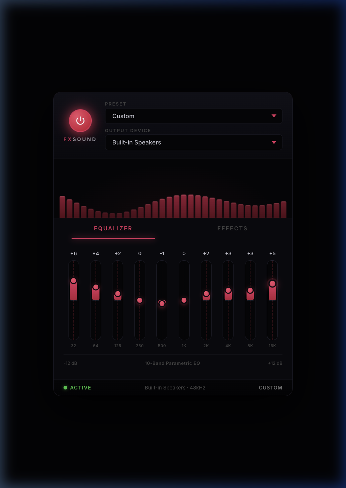
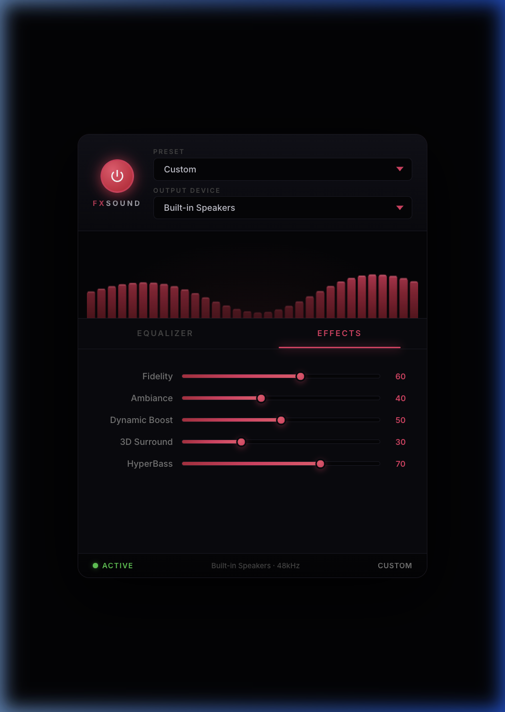

# FXSound for Linux

> A free, open-source audio enhancer for Linux — 10-band EQ, effects, presets, and real-time audio visualization.

[](./LICENSE)
[](https://reactjs.org)
[](https://pipewire.org/)
[](https://snapcraft.io/fxsound-linux)

---

## What is this?

FXSound is a popular Windows audio enhancer — but it has **no Linux version**. This project is a **full Linux-native recreation** with real PipeWire/PulseAudio audio processing, built with Tauri (Rust + React).

**This isn't just a UI mockup — it actually processes your system audio through a 10-band EQ and effects in real time.**

🌐 **Landing page:** https://fxsound-linux.pages.dev

---

## Screenshots





---

## Features

- **10-Band Parametric Equalizer** — biquad peak filters from 32Hz to 16kHz, ±12dB per band
- **5 Audio Effects** — Fidelity, Ambiance, Dynamic Boost, 3D Surround, HyperBass
- **10 Built-in Presets** — Music, Movies, Gaming, Podcast, Bass Boost, Vocal Boost, Deep Bass, Treble Boost, Night Mode, Flat
- **Real-time Audio Visualizer** — canvas-based FFT spectrum display at 60fps
- **PipeWire/PulseAudio Integration** — processes system audio in real time
- **Power Toggle** — instantly bypass all audio processing
- **Authentic FXSound Dark UI** — black and red theme matching the original Windows app
- **Keyboard Accessible** — full keyboard navigation with ARIA roles on all sliders
- **Native Linux App** — built with Tauri (Rust + React) for low resource usage

---

## Requirements

- **Linux** — Any distro with a modern desktop environment
- **Audio System** — PulseAudio or PipeWire (with PulseAudio compatibility layer)
  - Most modern distros ship with PipeWire by default (Ubuntu 22.10+, Fedora 34+, Arch)
  - Older distros use PulseAudio natively — both work
- **Architecture** — x86_64 (amd64)

---

## Quick Start

1. Download the AppImage (or .deb/.rpm) from the [latest release](https://github.com/Raul909/FXSound_For_Linux/releases/latest)
2. Make it executable: `chmod +x fxsound-linux_*.AppImage`
3. Run it: `./fxsound-linux_*.AppImage`
4. On first launch, the app will automatically detect your audio output devices
5. Select a preset from the dropdown (e.g., "Music") to get started
6. Adjust individual EQ bands or effect sliders to taste — any manual change switches to "Custom" preset

> **Note:** The app captures and re-outputs your system audio through its processing pipeline. If you hear double audio, make sure only one instance is running.

---

## Download & Install

### AppImage (Universal — All Distros)

The simplest way to run FXSound on any Linux distribution:

```bash
wget https://github.com/Raul909/FXSound_For_Linux/releases/latest/download/fxsound-linux_1.0.2_amd64.AppImage
chmod +x fxsound-linux_1.0.2_amd64.AppImage
./fxsound-linux_1.0.2_amd64.AppImage
```

> **Tip:** If you get a "Permission denied" error, make sure you've run `chmod +x` on the file.

### Debian / Ubuntu / Pop!_OS / Mint

```bash
wget https://github.com/Raul909/FXSound_For_Linux/releases/latest/download/fxsound-linux_1.0.2_amd64.deb
sudo dpkg -i fxsound-linux_1.0.2_amd64.deb
# If you get dependency errors:
sudo apt-get install -f
```

### Fedora / RHEL / openSUSE

```bash
wget https://github.com/Raul909/FXSound_For_Linux/releases/latest/download/fxsound-linux-1.0.2-1.x86_64.rpm
sudo rpm -i fxsound-linux-1.0.2-1.x86_64.rpm
```

### Snap

```bash
sudo snap install fxsound-linux
```

### Arch Linux (AUR)

```bash
yay -S fxsound-linux
```

### Flatpak

> 🚧 Coming soon — Flatpak/Flathub support is on the roadmap.

[→ Download Latest Release](https://github.com/Raul909/FXSound_For_Linux/releases/latest)

---

## Build from Source

### Ubuntu / Debian

```bash
# Install system dependencies
sudo apt install libwebkit2gtk-4.1-dev libgtk-3-dev libayatana-appindicator3-dev \
  librsvg2-dev libpulse-dev build-essential curl wget pkg-config

# Install Rust
curl --proto '=https' --tlsv1.2 -sSf https://sh.rustup.rs | sh
source $HOME/.cargo/env

# Clone and build
git clone https://github.com/Raul909/FXSound_For_Linux.git
cd FXSound_For_Linux
npm install
npm run tauri:dev       # Development mode (hot reload)
# npm run tauri:build   # Production binary (output in src-tauri/target/release)
```

### Fedora / RHEL

```bash
# Install system dependencies
sudo dnf install webkit2gtk4.1-devel gtk3-devel libappindicator-gtk3-devel \
  librsvg2-devel pulseaudio-libs-devel gcc pkg-config

# Install Rust
curl --proto '=https' --tlsv1.2 -sSf https://sh.rustup.rs | sh
source $HOME/.cargo/env

# Clone and build
git clone https://github.com/Raul909/FXSound_For_Linux.git
cd FXSound_For_Linux
npm install
npm run tauri:dev
```

### Arch Linux / Manjaro

```bash
# Install system dependencies
sudo pacman -S webkit2gtk-4.1 gtk3 libappindicator-gtk3 librsvg libpulse \
  base-devel curl wget pkg-config

# Install Rust
curl --proto '=https' --tlsv1.2 -sSf https://sh.rustup.rs | sh
source $HOME/.cargo/env

# Clone and build
git clone https://github.com/Raul909/FXSound_For_Linux.git
cd FXSound_For_Linux
npm install
npm run tauri:dev
```

---

## Tech Stack

| Technology | Purpose |
|------------|---------|
| Tauri 2.0  | Native app framework |
| Rust       | Audio processing backend |
| React 19   | UI framework |
| Vite       | Build tool |
| PulseAudio | Linux audio system integration |
| RustFFT    | Real-time spectrum analysis |

---

## Architecture

- **Frontend** (`src/`) — React 19 with `useCallback`/`useMemo` throughout; canvas-based visualizer (zero DOM mutations at 60fps)
- **Backend** (`src-tauri/src/audio.rs`) — biquad IIR filters per EQ band, FFT via RustFFT, PulseAudio capture/playback loop
- **IPC** — Tauri `invoke()` calls: `set_eq_band`, `set_effect`, `set_power`, `get_visualizer_data`, `get_audio_devices`

---

## Troubleshooting

### "404 Not Found" when downloading

Make sure you're downloading from the [latest release page](https://github.com/Raul909/FXSound_For_Linux/releases/latest). The download URLs contain the version number — if a newer version is released, old URLs may stop working.

### No audio output / Double audio

- Make sure only **one instance** of FXSound is running
- Check that PulseAudio/PipeWire is running: `pactl info`
- Restart PulseAudio if needed: `pulseaudio -k && pulseaudio --start`
- For PipeWire: `systemctl --user restart pipewire pipewire-pulse`

### AppImage won't launch

```bash
# Make it executable
chmod +x fxsound-linux_*.AppImage

# If you get a FUSE error on newer distros:
sudo apt install libfuse2    # Ubuntu 22.04+
# or extract and run directly:
./fxsound-linux_*.AppImage --appimage-extract
./squashfs-root/AppRun
```

### "Failed to start audio processor" error

This usually means PulseAudio can't find a monitor source. Check:
```bash
# List available sources (look for one ending in .monitor)
pactl list short sources

# If no monitor source exists, you may need to load the module:
pactl load-module module-loopback
```

### Build errors

- Make sure all system dependencies are installed (see [Build from Source](#build-from-source))
- Ensure Rust is up to date: `rustup update`
- Ensure Node.js 18+ is installed: `node --version`
- Clear build cache: `cd src-tauri && cargo clean && cd .. && npm run tauri:build`

---

## Roadmap

- [x] 10-band EQ with biquad filters
- [x] 5 effect sliders with presets
- [x] Real-time canvas visualizer (60fps)
- [x] Output device selector
- [x] Power toggle / bypass
- [x] PulseAudio integration
- [x] GitHub Actions release pipeline
- [x] Snap Store publishing
- [x] Cloudflare Pages landing site
- [x] Keyboard accessibility (ARIA sliders)
- [ ] Reverb (Ambiance effect)
- [ ] HRTF 3D Surround
- [ ] Save/export custom presets
- [ ] Per-application audio routing
- [ ] System tray integration
- [ ] Flatpak / Flathub

---

## Deployment

Releases are automated via GitHub Actions on every `git tag v*` push:
- Builds AppImage, .deb, .rpm → published to GitHub Releases
- Publishes to Snap Store
- Deploys landing page to Cloudflare Pages

See [DEPLOYMENT.md](./DEPLOYMENT.md) for manual deployment guides.

---

## Contributing

Contributions are welcome! Open an issue or submit a PR.

```bash
git checkout -b feature/your-feature-name
git commit -m "Add your feature"
git push origin feature/your-feature-name
```

---

## FAQ

**Is this the official FXSound for Linux?**
No. This is an independent open-source project inspired by FXSound (Windows only).

**Does this actually process my system audio?**
Yes. The app uses PulseAudio to capture, process, and output system audio in real time with EQ and effects.

**What Linux distros does this work on?**
Any distro with PulseAudio or PipeWire — Ubuntu, Arch, Fedora, Debian, Mint, Pop!_OS, Manjaro, and more.

**Is it free?**
Yes, completely free and open-source (MIT license).

**Can I change the visualizer colors or theme?**
The app uses the authentic FXSound dark theme with red accents. Custom themes are not yet supported but are being considered for future releases.

---

## Related

- [FXSound (Official, Windows only)](https://www.fxsound.com)
- [EasyEffects](https://github.com/wwmm/easyeffects) — another great Linux audio tool

---

## License

MIT © 2025 — Free to use, modify, and distribute.

<p align="center">
  Made for the Linux audio community 🐧<br/>
  <a href="https://github.com/Raul909/FXSound_For_Linux/issues">Report Bug</a> ·
  <a href="https://github.com/Raul909/FXSound_For_Linux/issues">Request Feature</a> ·
  <a href="https://fxsound-linux.pages.dev">Website</a>
</p>
